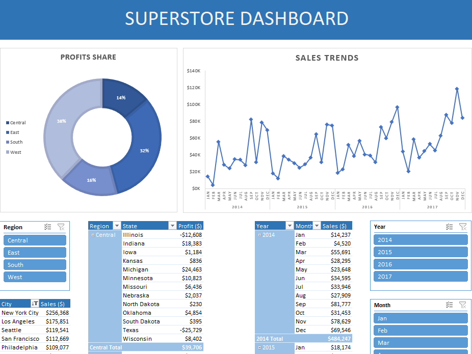

# Superstore Analytics Dashboard

## Overview
This project involved a detailed analysis and visualization of sales data from the [Superstore dataset](https://www.kaggle.com/datasets/vivek468/superstore-dataset-final) available on Kaggle. The primary goal was to extract key insights related to sales, profits and product performance.

## Data Source
The Superstore dataset was sourced from Kaggle, containing extensive information on sales transactions, customer details, product categories, and profitability metrics.

## Methodology
The project was structured in several phases:

1. **Data Preparation and Cleaning**: The dataset was imported into Excel using Power Query. I conducted thorough data cleaning to rectify issues such as missing values and duplicates and created calculated columns for more in-depth analysis.

2. **Developing the Data Model**: Using Power Pivot in Excel, I defined relationships between different tables. Power Query was utilized for data transformations and lookups.

3. **PivotTable Analysis and Reporting**: PivotTables were created to analyze various aspects such as sales trends, customer demographics, and product performance. Basic reports focusing on key metrics like total sales and average profit were generated.

4. **Advanced Reporting and Dashboard Creation**: This phase involved creating advanced charts for trend analysis and applying conditional formatting to highlight significant data points. A comprehensive Excel dashboard was developed, incorporating interactive elements for data exploration.

  <em>Image: Interactive dashboard visualizing Superstore data.</em>

## Project Outcome
The final deliverable is an interactive Excel dashboard that offers a multi-faceted view of the Superstore data. It allows for an intuitive exploration of sales trends, profitability, and customer behavior, making it a valuable tool for business decision-making and strategy formulation.
